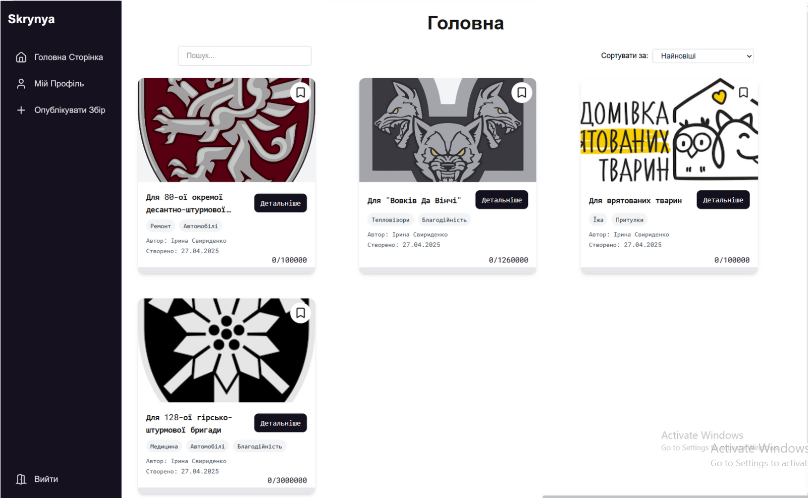
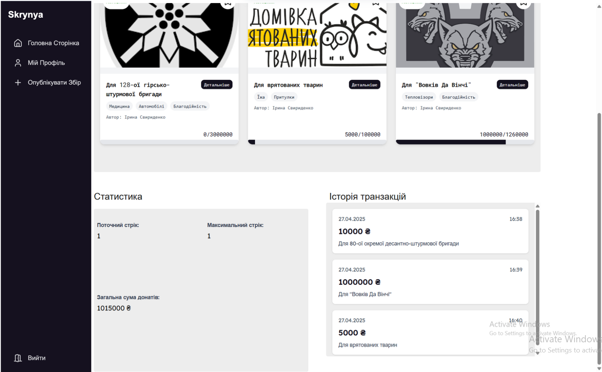
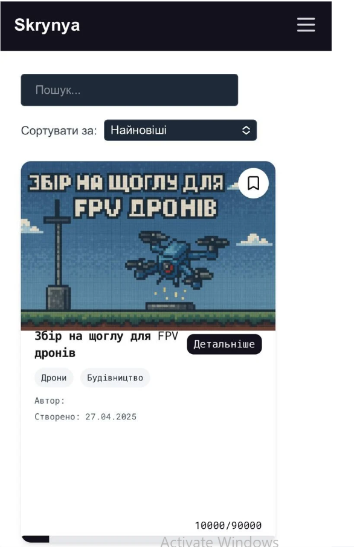
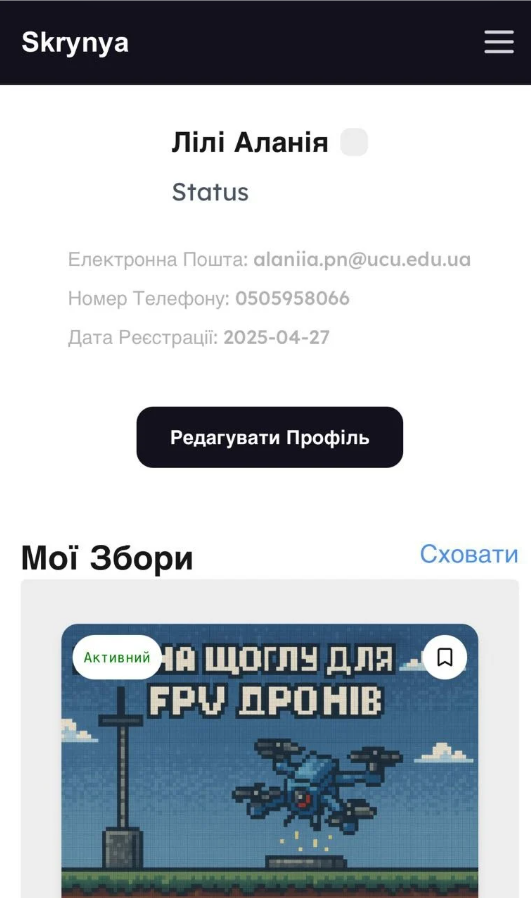

# Skrinya Semester Project

**Skrinya** is a web application for hosting and supporting fundraising campaigns.
The platform enables users to create, view, and support fundraising campaigns with detailed descriptions, progress tracking, and contributor management.

## Features

- **Campaign management**: Create and view detailed fundraising campaigns.
- **Progress tracking**: Campaigns show current funding progress toward a goal.
- **Tagging system**: Easily categorize and discover campaigns by tags.
- **User profiles**: Edit your profile and view your contributions.
- **Support campaigns**: Users can contribute to active campaigns.
- **Internal sturcture**:
  - **Frontend**: Next.js, React, TailwindCSS
  - **Backend**: FastAPI
  - **Database**: SQLite

## Structure

| Frontend          | Backend        | Database      |
|-------------------|----------------|---------------|
| Next.js 14        | FastAPI        | SQLite        |
| React 18          | Uvicorn        |               |
| TailwindCSS       | Pydantic       |               |
| TypeScript        |                |               |

## Project Structure

```bash
.
├── backend/
│   ├── api
│   │   ├── routers/
│   │   ├── __init__.py   
│   │   ├── database.py
│   │   ├── deps.py
│   │   ├── main.py
│   │   ├── models.py
│   │── .env
│   └── requirements.txt
├── frontend/
│   ├── public  
│   ├── src
│   │   ├── app     
│   │   ├── components
│   │   ├── fonts
│   ├── package.json  
├── alembic.ini
└── README.md
```

## Setup Instructions

### Prerequisites

- Node.js (v18+)
- Python (v3.12.5)
- SQLite database

### 1. Backend

```bash
cd backend
pip install -r requirements.txt
py fastapi run main.py #or py -m fastapi run main.py on Windows
```

> By default, backend runs at `http://localhost:8000`.

### 2. Frontend

```bash
cd frontend
npm install
npm run dev
```

> Frontend will run at `http://localhost:3000`.

## Example Screenshots






## Development Notes

- **Routing**: Frontend uses Next.js App Router (`/app`) structure.
- **Backend CORS** is configured to allow connections from the frontend.
- **APIs**: Campaigns, donations, and users are managed through RESTful FastAPI endpoints(GET, PUT, POST, DELETE).
- **Styling**: TailwindCSS is used for fast, responsive UI development.

---

## Authors

- [rasthpop](https://github.com/rasthpop)
- [ruzhylopv](https://github.com/ruzhylopv)
- [LiliAlania](https://github.com/LiliAlania)
- [irasvyrydenko](https://github.com/irasvyrydenko)

---

## License

This project is licensed under the [MIT License](LICENSE).

---

Would you also like me to prepare a shorter "TL;DR" version of the README for the repo description? 🚀
